# AI-based Village Pond Planning System — Technical Report

**Author:** Rahul Raj · **Course:** 7th semester, Assignment 1 · **Submission:** 5 September 2026
**Repository:** https://github.com/Rahul5977/AI-BasedPondAnalysis
**Phase 2 route (deployed):** `POST http://10.1.75.53:4269/api/v1/analyzeContour` — running on the provided lab machine *stu78_sys1*, campus network. Interactive documentation: http://10.1.75.53:4269/docs · web app: http://10.1.75.53:4269/ .
Also runnable anywhere: `make up && make seed` (full 11-service stack) or `make serve-single` (one process, no Docker); `make tunnel` adds a public ngrok URL for the demonstration.

---

## 1. Problem statement and objectives

Water conservation in rural India depends on small ponds built where the terrain will
actually deliver runoff to them. Choosing such a site by hand needs a topographic survey,
a rainfall record, a runoff estimate and a storage calculation — expertise a Gram Panchayat
rarely has on hand. The assignment asks for a web application that does this from
geospatial and satellite data and presents the result on an interactive map (FR1–FR8).

The objective of this implementation is narrower and sharper than "a map with numbers":
**every figure must be derived from the uploaded input, carry its unit and an honest
uncertainty band, and be traceable to a named, cited algorithm** that the author can defend
live. The examined topic — how the area is selected and how the catchment is computed — is
therefore where most of the engineering depth sits (§4–§6).

## 2. Requirements coverage

| FR | Requirement | Where it is met | Evidence |
|---|---|---|---|
| 1 | Satellite imagery for a selected village | Esri World Imagery basemap; village derived from the upload and named by reverse-geocoding its centroid; focus mask dims the outside | `docs/figures/p1-walking-skeleton.jpg` |
| 2 | Contour map visualisation | Marching-squares contours from the working DEM, 1/2/5/10 m, labelled, Douglas-Peucker simplified (5 097 → 1 408 vertices at 2 m) | `p2-contours-5m.jpg` |
| 3 | Land available for excavation | Specification-pattern constraints on slope, water buffer (NDWI), habitation band, land cover, ownership, contiguity; parcels as polygons | `p4-ndwi-opencv.png`, `available_land` route |
| 4 | Catchment of a selected point | Priority-Flood + D8 + nearest-channel snapping + upstream BFS; polygon, area, longest flow path, relief; validated | `p2-click-to-catchment.jpg`, §7 |
| 5 | Historical rainfall from public APIs | Open-Meteo ERA5-Land (45 yr) with NASA POWER fallback; Weibull 75 % dependable, JJAS share, rainy days, Gumbel 25-yr | `p3-rainfall-panel.jpg` |
| 6 | Runoff volume | SCS-CN on the daily series, rational coefficient, Strange's table — a range with its spread | `p3-design-panel.jpg` |
| 7 | Pond depth and storage | Cost-optimised excavated frustum, EAV curve, daily water balance → fill reliability, spillway, BoQ, confidence | `p3-design-panel.jpg` |
| 8 | All results overlaid | Results overlay with the six PDF items, pond footprint drawn at the outlet, 13 toggleable layers | `p5-all-overlays.jpg` |

## 3. System architecture

### 3.1 Layers and services

The application is layered (ADR 0001) with dependencies pointing inwards only, enforced by
`tests/test_layering.py`: `api` (routers, zero business logic) → `engines` (pure numpy
algorithms and use-case workflows) → `providers` (external data adapters) / `repositories`
(persistence) → `domain` (units, errors, value objects; imports nothing but numpy).

Eleven Docker Compose services, each arriving in the phase that first called it (ADR 0004):
PostGIS, Redis, MinIO, the API, two Celery workers (interactive/heavy bulkheads), beat,
TiTiler, nginx + the React/MapLibre SPA, Prometheus, Grafana.

### 3.2 Stack reconciliation against the suggested stack

| Suggested | Chosen | Why (ADR) |
|---|---|---|
| Flask or FastAPI | FastAPI | Typed contract generated for free (OpenAPI, 40+ operations), async job routes, dependency injection for ports (ADR 0005) |
| MongoDB / PostgreSQL | PostgreSQL + PostGIS | Boundaries, `ST_Equals` village reuse, spatial types; append-only audit rules in the database (ADR 0006) |
| Elevation APIs (point queries) | Full DEM rasters from the uploaded contour map (and a documented provider-tile adapter) | Catchment delineation needs a grid, not points; point APIs cannot give flow direction (ADR 0007, 0011) |
| Rainfall APIs (IMD, Open-Meteo, NASA POWER) | Open-Meteo ERA5-Land primary, NASA POWER fallback | Keyless, daily, 45 years in 2 s; IMD gridded needs registration (decision log) |
| OpenCV | OpenCV for the NDWI water mask: Otsu threshold, morphological open/close, connected components | Used where it is the right tool, not decoratively (ADR 0017) |
| A basic frontend library | React + MapLibre GL | Vector + raster layers, offline-first service worker (ADR 0018) |

### 3.3 Design patterns applied

| Pattern | Where | Purpose |
|---|---|---|
| Ports & Adapters | `DEMProvider`, `RainfallProvider`, `ObjectStore`, `JobRunner`, repositories | Same pipeline in Docker, CI and tests; no mocks (ADR 0013) |
| Strategy | `RunoffMethod` (SCS-CN, rational, Strange); `DEMProvider` implementations | A range instead of one number; extensibility evidence (ADR 0010) |
| Specification | `SlopeUnder & ~WithinBuffer & …` | Readable, self-naming land constraints (ADR 0017) |
| Builder | `PondDesignBuilder` | Stage-by-stage assembly of the FR7 payload (ADR 0016) |
| Decorator | `Retry ∘ CircuitBreaker ∘ Cached` | Resilience without touching the adapters |
| Chain of Responsibility | `FallbackChain`, ordered elevation strategies in the KML parser | First provider/strategy that answers wins; provenance recorded |
| Flyweight | Curve-number table keyed by (land cover, soil group) | Eleven classes × four groups, not a raster of floats |
| Observer | WebSocket job progress over the job row | One source of truth, pushed on change |
| Saga | Persistence steps of the contour pipeline | Compensations in reverse on failure (ADR 0019) |
| State machine | Recommendation lifecycle | Illegal transitions are impossible, not merely unlikely |
| Transactional outbox | Recommendation events → audit log | Same-transaction event, asynchronous projection |
| Bulkhead | Two Celery queues and worker pools | A heavy job cannot delay a click |

## 4. Methodology

### 4.1 From contours to a DEM (P1)

The uploaded KML/KMZ is parsed tolerantly (namespace-agnostic, `<Folder>` root accepted)
but elevation is read strictly, by an ordered strategy — Z coordinate, then a whitelisted
`ExtendedData` field, then the placemark name — with numeric `ID` fields rejected, because the
sample carries exactly such a decoy (ADR 0011). The UTM zone is derived from the file's
centroid; `assert_crs()` refuses any computation in degrees.

Contour vertices are densified and triangulated (Delaunay TIN, linear interpolation), then
lightly smoothed (Gaussian, σ = 1 cell). The grid resolution is *derived*: cell = (hull area /
total contour length) / 4, floored at the source DEM's resolution, which is inferred from the
file's own metadata by an evidence-weighted match against a table of known datasets (the
sample names SRTM five times and by raw filename; a generic blurb names Copernicus once).
On the sample this gives a 30 m grid of 110 × 89 cells, and the honest statement that a 1 m
contour interval from a 30 m source is interpolated precision, not measured accuracy.

### 4.2 Hydrological conditioning and flow routing (P2)

- **Depression filling and flat resolution:** Priority-Flood + ε (Barnes, Lehman & Mulla
  2014; Wang & Liu 2006). One pass, O(n log n); the fill-depth raster is itself a figure
  (`p2-sink-fill-before-after.png`: 2 141 cells, max 8.6 m — TIN hollows and a river floor
  below its map-edge exit).
- **Flow direction:** D8 (O'Callaghan & Mark 1984), steepest descent over eight neighbours,
  diagonals divided by √2 (ADR 0009: deterministic, the GIS default, defensible; D-∞ is a
  documented stub).
- **Flow accumulation:** one descending-elevation pass — on a filled+ε surface that order
  is topological, so a single sorted loop is exact. Pure numpy, no numba.
- **Streams:** cells with ≥ 5 ha upstream (a threshold in area, so it means the same on any
  grid), traced into links with Strahler (1957) order; on the sample 101 links, order 3,
  24.4 km, visibly following the Sivnath and its tributaries (`p2-streams-on-satellite.jpg`).
- **Derived surfaces:** Horn (1981) slope/aspect/hillshade; Zevenbergen & Thorne (1987)
  profile and plan curvature (ArcGIS sign convention); TWI = ln(a / tan β) (Beven & Kirkby 1979).

### 4.3 Catchment delineation (FR4)

A click one cell off a channel returns a hillslope catchment orders of magnitude too small,
so the pour point is snapped to the **nearest** cell within 150 m that drains ≥ 2 ha —
nearest, not largest, so a tributary click is not dragged onto the main river — and the
distance moved is returned and shown. The catchment is the breadth-first search over the
inverse D8 graph from the snapped outlet; area, perimeter, longest flow path (BFS distances),
relief and outlet elevation follow. A catchment reaching the map edge is flagged
`catchment_truncated`. Uncertainty on the area is stated as max(15 %, one cell ring around
the perimeter) — on a 38 ha catchment of 30 m cells that is ±26 %.

### 4.4 The whole computation as a graph algorithm

The pipeline's core is a single graph structure built once per upload and reused by every
downstream engine. The figures below are generated from the real engine code on a small
synthetic Y-valley (`make figures`), so they cannot drift from the implementation.

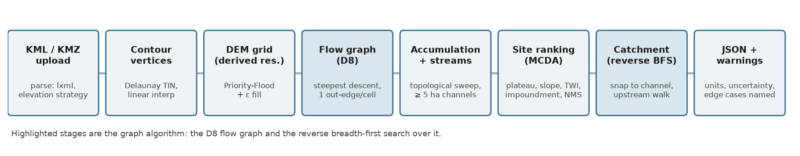

**Nodes and edges.** Every DEM cell is a node. D8 gives each node **at most one out-edge**
— to the steepest-descending of its eight neighbours (panel b below). A graph in which every
node has out-degree ≤ 1 is a *functional graph*; because the surface has been filled and
given an ε-gradient it contains no cycles, so it is a **forest of in-trees rooted at the
outlets** (edge cells where water leaves the map). Everything the API returns is a question
about this forest:

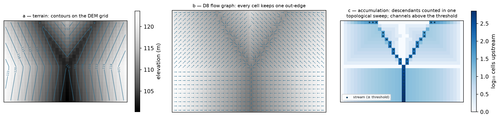

- **Flow accumulation = subtree size.** The number of cells draining through a node is the
  size of the subtree rooted at it. Rather than recursing, the engine visits nodes in
  descending elevation — on a filled + ε surface that order is a **topological order** of the
  graph — and pushes each node's count onto its receiver: one exact O(n) sweep (panel c).
- **Streams = a thresholded subgraph.** Channel cells are nodes whose subtree exceeds 5 ha
  (a threshold in *area*, so it means the same at any grid resolution). Walking the stream
  subgraph from sources to junctions yields links and Strahler order — order rises only
  where two children of equal order meet, a property of the tree, not of geometry.
- **Catchment = reverse breadth-first search.** The catchment of a pour point is the set of
  nodes from which the outlet is reachable: a BFS over the *inverted* edges, exactly the
  textbook traversal, shown as its wavefront below. Area, longest flow path (the deepest
  BFS level × cell size, diagonals √2) and relief fall out of the same walk.

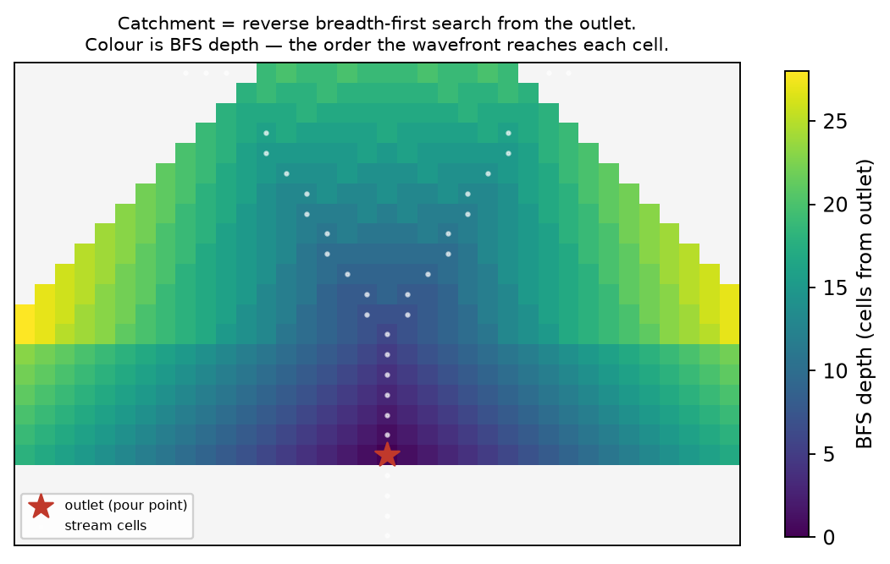

**Complexity and measured cost.** Priority-Flood fill O(n log n); the elevation sort
O(n log n); accumulation, stream extraction and each BFS O(n). The sample's 110 × 89 grid
(9 790 nodes) completes the whole pipeline in ~2 s inside the request worker; the catchment
BFS itself runs in about a millisecond. Nothing here needs numba or a GPU at village scale —
a deliberate choice, because every line must be explainable live.

### 4.5 Site selection (Phase 2 "where"; ADR 0014)

Candidates are drainage-network cells not within three cells of the map edge, with slope
≤ 15 %. Each is scored by a weighted sum of four memberships in [0, 1]:

- **upstream area** — a plateau in log10 hectares: 0 at 1 ha, 1 from 10 to 150 ha, 0 at
  1 000 ha. A first version scored area monotonically and put every top site on the main
  river; a village pond is not a river dam;
- **flatness** — 1 on 0–3 % slope, falling to 0 at 15 % (an optimum at exactly 0 % would
  reward floodplains and DEM artefacts);
- **wetness** — normalised TWI;
- **impoundment efficiency** — the volume held behind a nominal 2 m rise (8-connected flood
  fill on the upstream side of a bund) divided by the pool footprint: a mean depth that
  rewards natural basins.

Weights come from a declared Saaty pairwise matrix by the principal eigenvector (AHP, Saaty
1980); the consistency ratio is computed with Saaty's random index and returned — CR = 0.004
for the default matrix; an intransitive matrix is rejected in a golden test. Non-maximum
suppression at 200 m keeps the top-N distinct. The top site's catchment is delineated and
returned with the ranking and every candidate's per-criterion scores, so the answer to "why
here?" is in the response.

### 4.6 Rainfall (FR5)

Daily precipitation from Open-Meteo's ERA5-Land archive (1981–2025 for the sample's centroid),
NASA POWER as fallback, both behind `Retry ∘ CircuitBreaker ∘ Cached` and a `FallbackChain`
that records which provider answered. Statistics on complete calendar years only (incomplete
years excluded, never scaled): mean, median, CV, **75 % dependable rainfall by the Weibull
plotting position** P = m/(n+1) (the design figure in Indian minor-irrigation practice),
June–September share, IMD rainy days (≥ 2.5 mm), maximum 1-day, monthly normals, and the
25-year 1-day depth by a Gumbel EV1 fit (method of moments) on annual maxima.

### 4.7 Runoff (FR6)

Land cover from ESA WorldCover 2021 (10 m), read as a window straight from the public COG;
topsoil texture from ISRIC SoilGrids → hydrologic soil group (USDA rule of thumb; default C
with a warning when SoilGrids times out). The composite curve number is the area-weighted
TR-55 value over the catchment (AMC II, Hawkins adjustment available). Three methods run on the
daily series and report 75 % dependable annual runoff volumes:

- **SCS-CN** (USDA-SCS 1972; TR-55 1986): Q = (P − Iₐ)² / (P − Iₐ + S), S = 25400/CN − 254 mm,
  Iₐ = 0.2 S, per day, then summed — applied to an annual total it overestimates runoff more
  than threefold (asserted by a test);
- **runoff coefficient** (rational form, ASCE coefficients by land cover): the crude upper bracket;
- **Strange's table** (1928, Madras PWD) by daily rainfall and catchment condition.

The spread between them is reported, not hidden (188 % on the sample's top site); SCS-CN is the design figure.

### 4.8 Pond design (FR7; ADR 0016)

Target storage = 75 % dependable runoff × 0.6 harvest efficiency, clamped to
[2 000, 50 000] m³ (a village pond, not a reservoir; when the cap binds the response says so).
Geometry: an excavated inverted frustum, 2:1 side slopes, prismoidal volume, 0.5 m freeboard,
bottom ≥ 5 m each way. **Depth is derived by cost**: a grid search over depth 1.5–3.5 m and
aspect 1–2 solves each candidate's top dimensions for the target and picks the cheapest
(₹160/m³ cut, ₹220/m³ bund, indicative 2024 bands), ties to the smaller water surface.
A daily water balance over the record (inflow = SCS-CN runoff × area × 0.6; evaporation 0.7 ×
pan from a monthly climatology; seepage 2 mm/day; 15 % dead storage) yields the fill
reliability — the share of years reaching ≥ 90 % — plus months with water and mean spill.
The spillway is sized for the 25-year storm (IMD short-duration reduction, Kirpich time of
concentration, rational peak, broad-crested weir). A bill of quantities and a confidence label
decided by the worst input (assumed land cover or soil, cached rainfall, edge-limited
catchment) complete the payload; the natural EAV curve of the site is reported alongside.

### 4.9 Edge cases, and what the API says about them

An analysis that silently produces a wrong-looking number is worse than one that refuses; the
edge cases below are handled *and named in the response* so the caller knows what happened.

| Edge case | Behaviour | Where it is proven |
|---|---|---|
| **A river already crosses the area** | Channel cells at or beyond the plateau's upper bound (1 000 ha default) are hard-excluded from siting — with no better cell available a soft score alone would still put the pond on the river. Any channel beyond the 10–150 ha ideal triggers the `existing_watercourse` warning naming the largest channel's size. On the sample the response says the ~416 ha watercourse is avoided and candidates sit on tributaries. | golden test `test_an_existing_river_is_excluded_from_siting_not_just_scored_down`; figure below |
| Flat / featureless terrain | No drainage network forms → siting returns an empty candidate list, the route answers with the `no_site_found` critical warning rather than an arbitrary point | golden test `test_flat_terrain_yields_no_candidates…` |
| Catchment cut by the map edge | The uploaded extent bounds the analysis, not a real divide: `catchment_truncated` warning; candidate sites keep a 3-cell margin from the edge so their catchments are not trivially cut | engine + API tests; visible on the sample |
| Garbage / empty / non-XML upload | `422 unsupported_input` problem document, never a 500 | parser tests; e2e check |
| Elevation decoy (`ID` field), missing elevation | Ordered elevation strategy with a whitelist; a file with only an `ID`-like numeric field raises `elevation_not_found` rather than guessing | parser tests on the sample's own decoy |
| Click far from any channel | Snap searches 150 m for a cell draining ≥ 2 ha; nothing found → `422` validation problem naming the radius | `test_snap_moves_a_flank_click…` |
| Depressions / closed basins in the TIN | Priority-Flood fills them (2 141 cells on the sample, max 8.6 m) and the fill depth is reported as a figure, not hidden | `p2-sink-fill-before-after.png` |
| Provider outages (rainfall, soil, land cover) | Fallback chain → cache → stated defaults, each with a warning and a lowered confidence label; the demo runs fully offline | resilience tests with injected failures |
| Geocoder unreachable | Village named from its coordinates with the `geocode_unavailable` info warning | seen live on the lab-VM deployment |

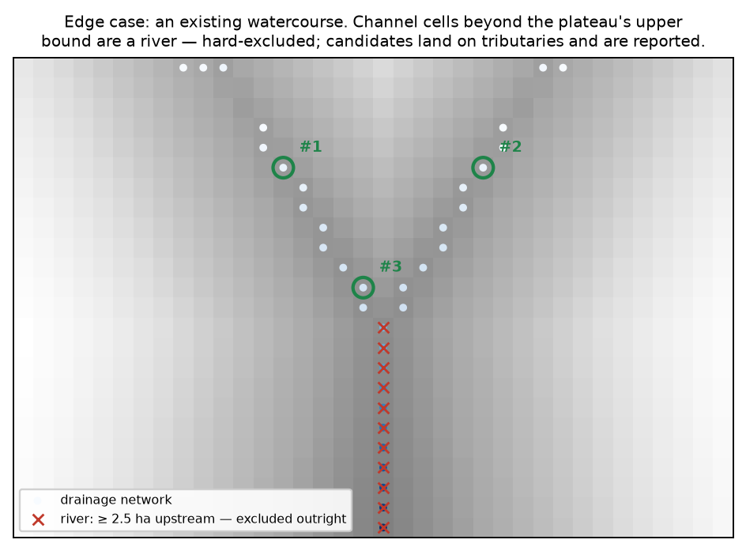

## 5. Software design and quality

- **Code quality:** `ruff` clean, `mypy --strict` on `domain/` and `engines/`, 206 tests,
  layering enforced by an executable test; every engine module's docstring names the algorithm
  and its citation. Coverage: **engines 94.3 %, domain 97.6 %, overall 86.2 %**
  (`docs/figures/p7-coverage.jpg`).
- **Test taxonomy:** golden tests with analytic answers (inclined plane, cone, V-valley,
  Y-valley, artificial pit, flat terrace, frustum hand calculation, SCS-CN hand calculation,
  monotonicity of runoff in rainfall), parser tests on the sample and on Z/ExtendedData/KMZ/
  decoy variants, recorded-response tests for the rainfall adapters, resilience-decorator
  tests with injected failures, end-to-end API flows on the real sample with the in-memory
  adapters, the pysheds cross-check, and the saga compensation test.
- **Git hygiene:** conventional commits, one feature per commit, no secrets or generated
  binaries (COGs are regenerated by `make seed`), `.env.example` documents every variable.

## 6. System design and management (ADR 0019)

Async jobs with `202` + poll/WebSocket and real stage percentages; two bulkhead queues
(a catchment returned in 0.6 s while a suitability job was running); idempotency keys;
backpressure `429 + Retry-After`; RS256 JWT with viewer/planner/officer roles; a
recommendation state machine whose transitions write a transactional outbox drained into an
append-only audit log; request-correlation ids in every JSON log line; Prometheus metrics
from the API and both workers with a provisioned Grafana dashboard; a leader-elected nightly
rainfall refresh; an offline-first service worker (ADR 0018). Load test (Locust, 50 users,
60 s): 1 102 catchment submissions, POST p95 33 ms, end-to-end p95 560 ms, 0 HTTP failures.
Chaos test: with the API container stopped, the reloaded page still shows the village,
its layers, rainfall and sites from cache under an "Offline" badge (`docs/media/chaos-test.gif`);
the test caught a real bug on its first run — a reverse proxy answers 502, which is a response,
not a network error — now handled.

Scaling arithmetic and the distributed roadmap are in `docs/PLAN.md` Part 9; the bottleneck to
national deployment is cadastral data and institutional trust, not compute.

### 6.1 Deployment on the provided lab machines

The provided machines (`student@10.1.75.53`, four systems) turn out to be unprivileged
containers: no Docker daemon, no systemd, no root. This is exactly the situation the
ports-and-adapters decision (ADR 0013) was made for — the same engines run behind in-memory
persistence, an inline job runner and a local object store, so the whole system deploys as
**one uvicorn process** serving both the API and the built SPA
(`scripts/single_server.py`, `make serve-single`):

- **URL:** http://10.1.75.53:4269 (host port 4269 → container port 4000 on *stu78_sys1*);
  Swagger at `/docs`, the planner at `/app`.
- **Install:** copy the tree, `uv sync --no-dev`, `~/pond/run.sh` (recorded-rainfall mode, so
  no outbound dependency); restart is the same script.
- **Verified:** the same 42-check end-to-end suite passes against the lab VM as against the
  full Docker stack (`docs/figures/e2e-api-lab-vm.txt`), including a live Sentinel-2
  suitability read from the lab network.
- **Trade-off, stated:** raster tile layers need TiTiler and are absent in this mode; every
  vector product (catchment, contours, streams, sites) is served by the API and renders
  normally. The full 11-service stack remains the reference deployment (`make up`).

The readiness probe originally reported this deployment as permanently degraded because it
probed postgres and redis unconditionally; it now probes only the *configured* adapters — a
real bug found by deploying, fixed with a test.

Deploying the same codebase two ways — eleven services with bulkheads, backpressure and
observability on Docker, and a single process on a bare student VM — is the practical
scalability lesson of this project: the layering pays for itself when the environment
changes, and the load numbers above say when the heavier shape is actually needed.

## 7. Validation and results

| Check | Method | Result |
|---|---|---|
| Interpolation | Inclined plane and cone contours, analytic elevations | RMS < 0.15 m (plane), < 0.25 m between rings (cone); summits above the top contour are flattened — a documented limitation |
| Sink filling | Synthetic pit; flat terrace | Pit filled exactly to its spill level, nothing else touched; every cell drains after +ε |
| Accumulation | Inclined plane (count of upslope cells); bowl | Exact match; bowl drains to its centre unfilled and to its rim filled |
| Delineation | V-valley: catchment = the rectangle upstream of the outlet; Y-valley: Strahler order 2 | Exact |
| **Independent implementation** | pysheds (Bartos 2020) on the sample DEM, outlets snapped in both models | 2.0 %, 3.4 % (Jaccard 0.98, 0.97) on the main outlets; 22.5 % (0.77) on a floodplain flat where the two flat-resolution schemes route differently — reported, not hidden (ADR 0015) |
| Pour-point sensitivity | Catchment area over a ±3-cell window around a channel cell | CV 212 % without snapping, 48 % with (`p2-pour-point-sensitivity.png`) |
| Stream threshold | Overlay on imagery | The 5 ha network reproduces the Sivnath and its main tributaries without hillside noise |
| Water mask | Sentinel-2 NDWI, three post-monsoon scenes | 32 raw components → 20 water bodies, 9.0 % of the area; WorldCover 2021 independently says 8.1 % |
| AHP | Default matrix; perfectly consistent matrix; intransitive matrix | CR 0.004; 0.000; rejected (> 0.10) |
| Rainfall | Recorded ERA5-Land, Khapri | 45 complete years; mean 1 313 mm, 75 % dependable 1 168 mm, monsoon share 89 %, 86 rainy days |
| Runoff | Hand calculation, CN 80, 50 mm day | Q = 13.8 mm; annual-total shortcut > 3× the daily sum |
| Design | Frustum hand calculation; optimiser feasibility; water balance on synthetic seasons | Exact; cheapest feasible design chosen; small pond fills every year, oversized pond never |
| **Existing ponds** | OSM's two mapped tanks inside the extent, designed at their centroids | Local runoff is a tenth of their capacity (canal-fed tanks in the Durg command area); natural impoundment at +2 m within −40 % of the larger tank's capacity (`p3-existing-pond-comparison.md`) |
| Load | Locust 50 users / 60 s | POST p95 33 ms, end-to-end p95 560 ms |
| **End-to-end API smoke** | `make e2e` — 42 checks over HTTP: every real route in cookbook order plus the negative paths (viewer approve → 403, draft → approved → 409, missing village → 404, garbage upload → 422, the `existing_watercourse` warning) | **42/42 against the Docker stack and 42/42 against the lab-VM deployment** (`e2e-api-local-stack.txt`, `e2e-api-lab-vm.txt`) |

Sample-map headline numbers (Khapri, Durg, Chhattisgarh, EPSG:32644, 830 ha): top site drains
38.25 ha (±26 %); 75 % dependable rainfall 1 168 mm; CN 88 (HSG C); SCS-CN 99 k m³
(rational 244 k, Strange 18 k); design 50 000 m³ (capped; harvestable 59.5 k), 3.5 m deep,
126 × 126 m top, fills in 100 % of years, ₹97 lakh indicative, confidence *low* (soil assumed);
27 ha of eligible land in 16 patches.

## 8. Limitations and uncertainty

The DEM is interpolated from contours that are themselves interpolated from ~30 m SRTM
(±6 m relative): relief below about 5 m is not real, single-cell extremes are lost, and the
sample's summit and valley floor sit 2–3 m inside the contour range. Every storage figure
therefore carries ±20 % or worse and is planning-grade, not survey-grade. Ownership is
unknown without a cadastral layer and is never assumed. Reanalysis rainfall is ±15 % against
gauges. The three runoff methods disagree by up to 2×; the design uses SCS-CN and says so.
SoilGrids is slow and the default soil group is a stated assumption. The ML scoring path is
deferred by the plan's own fallback: two mapped tanks are not a training set (ADR 0017).

## 9. Future work

Ground-truth against 20–30 existing ponds in one block; a cadastral import with ownership
*class* only (DPDP Act 2023); local CN calibration; the provider-DEM adapter (Copernicus
GLO-30) for villages without a contour map; the ML/SHAP path once labels exist; the
distributed roadmap in `docs/PLAN.md` Part 9.

## 10. Use of AI tools

An AI coding assistant (Claude Code) was used throughout, under the author's direction and
review, as the assignment's LLM policy permits. Where it was used, concretely:

- **Code drafting and refactoring** — first drafts of engines and tests, then refactoring
  passes (extracting the workflow orchestrators, the ports-and-adapters split, tightening
  the layering the architecture test enforces);
- **Understanding the algorithm** — working through D8 as a functional graph, why a filled
  + ε surface makes descending elevation a topological order, and why catchment delineation
  is exactly a reverse BFS — the understanding §4.4 writes down;
- **Figuring out edge cases and brainstorming** — enumerating what breaks (an existing
  river in the area, flat maps, decoy elevation fields, truncated catchments, provider
  outages) and designing the behaviour and warnings in §4.9;
- **Learning how to scale the application** — the bulkhead/backpressure/outbox patterns in
  §6, and the practical lesson of deploying the same codebase as eleven services and as a
  single process on the lab VM (§6.1);
- **Report writing** — drafting and editing this document and the figures script; every
  number in it is produced by the code, not by the assistant;
- **Debugging** — several defects were found by *running* rather than reading, and are
  logged in `docs/PROGRESS.md` (e.g. the readiness probe reporting a Docker-less deployment
  degraded, a saga step that failed half-way, the Otsu clamp on a two-valued image).

Every design decision is recorded with its reasoning and rejected alternatives in
`docs/adr/` (19 records) and the decision log in `docs/PROGRESS.md`; every algorithm is
named and cited in its module docstring; the author can explain and justify each component
live.

## Appendix A — Figures

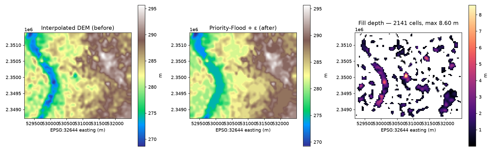

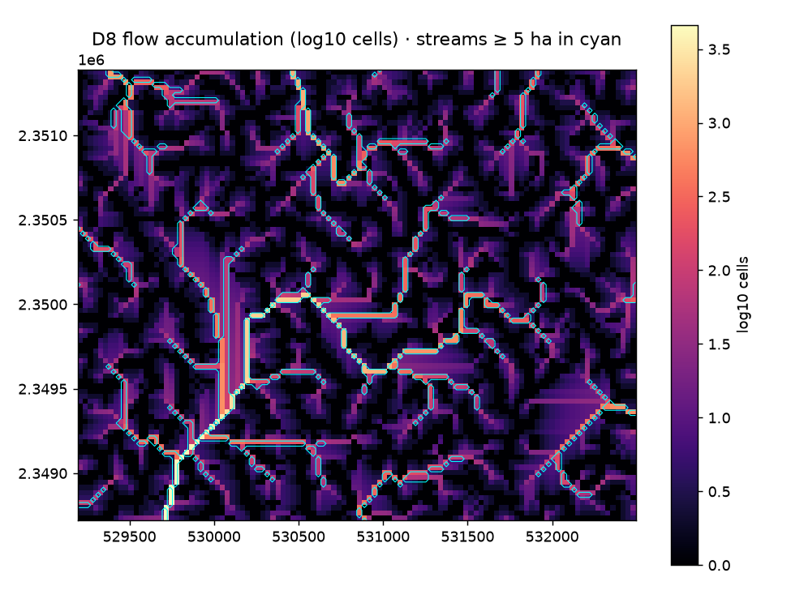

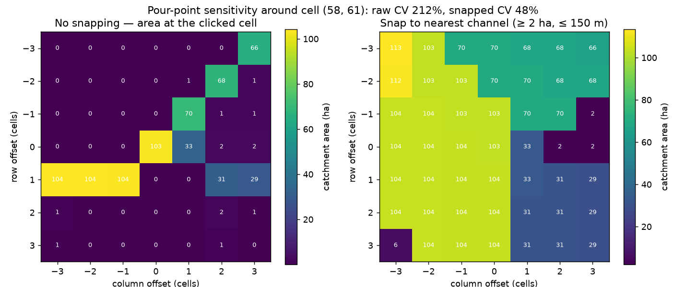

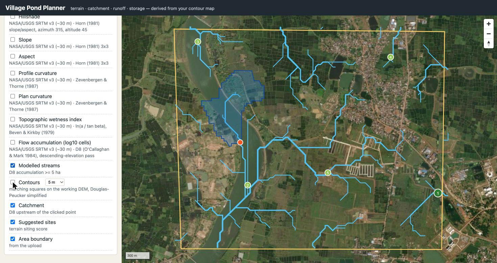

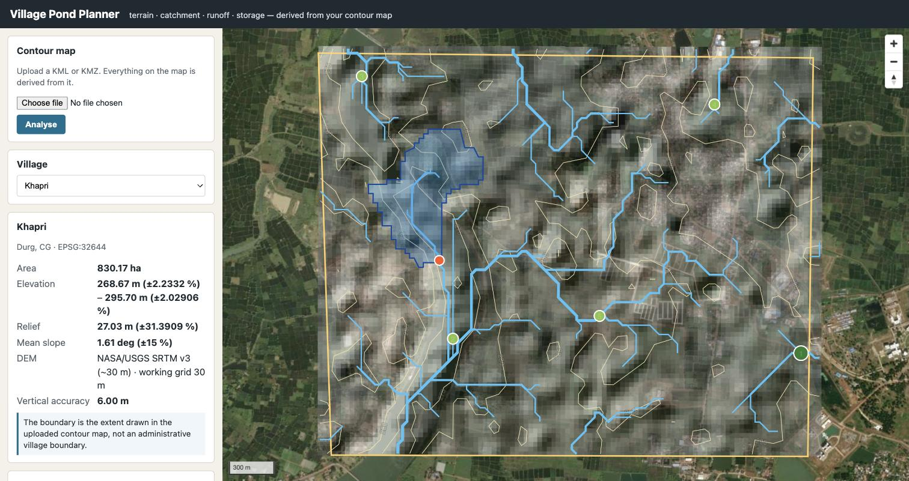

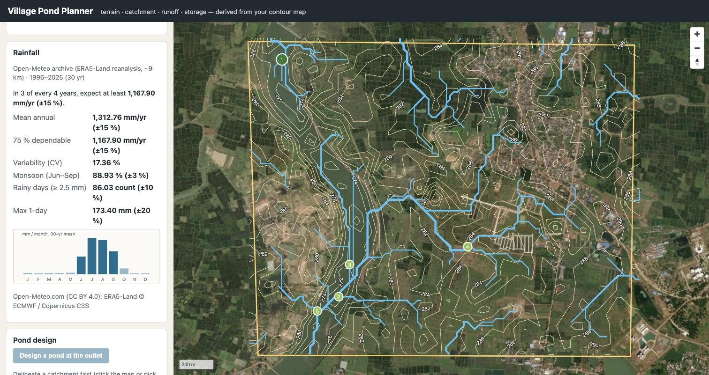

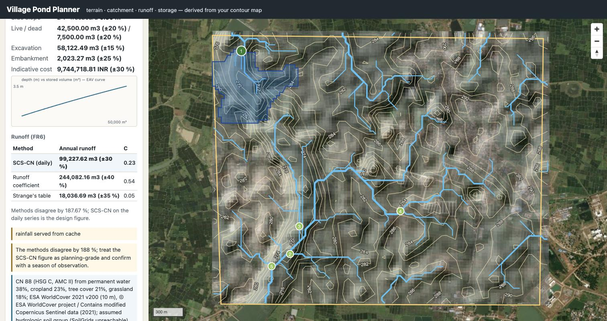

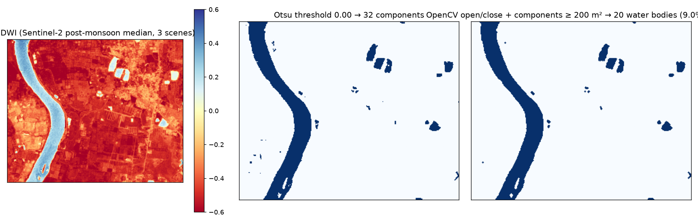

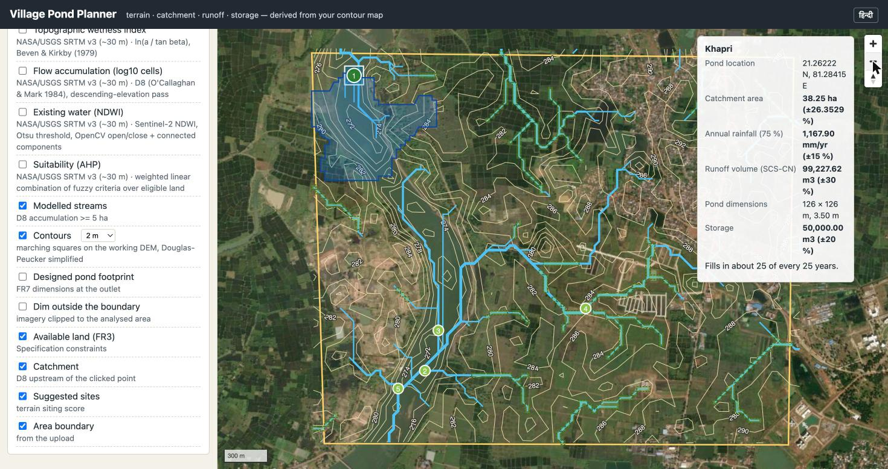

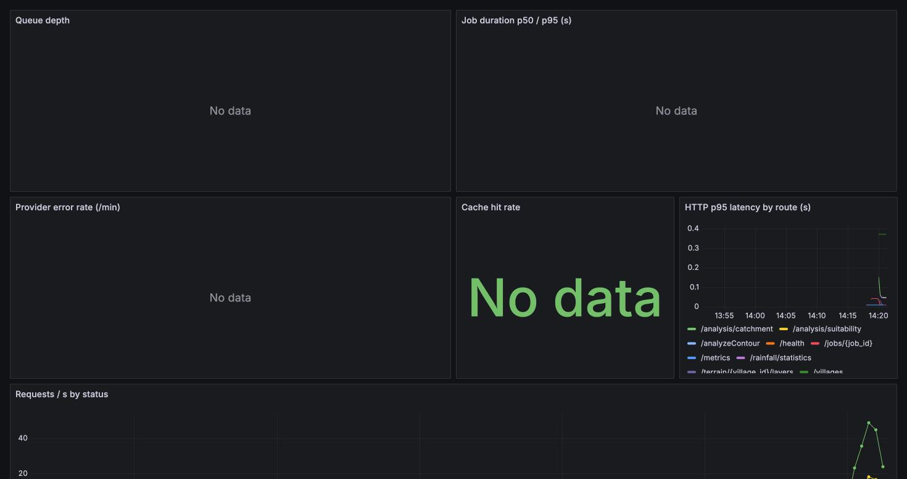

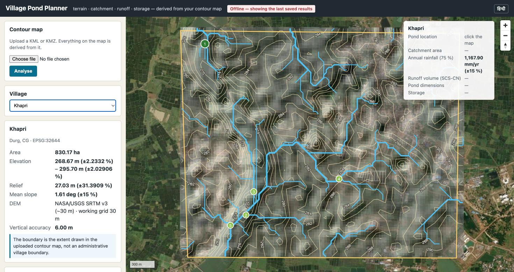

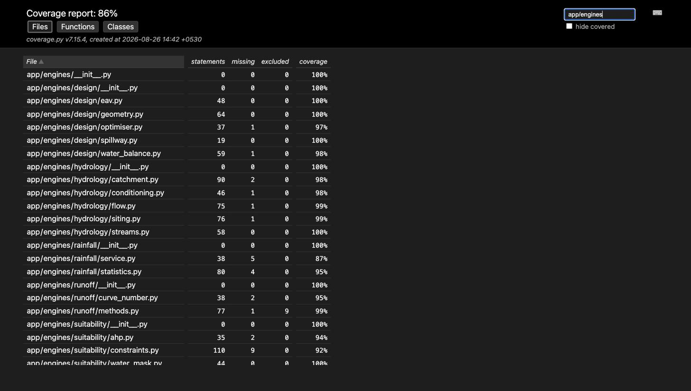

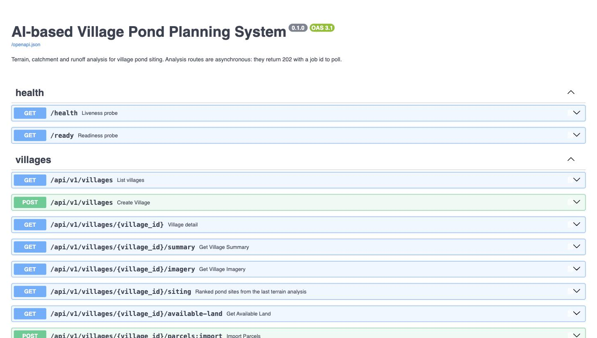

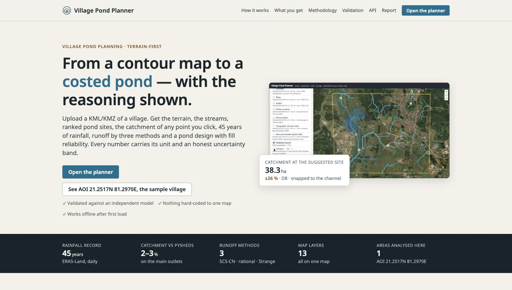

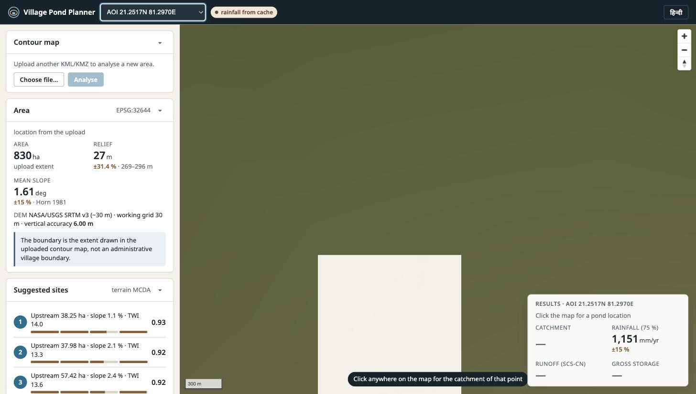

## References

- Barnes, R., Lehman, C., Mulla, D. (2014). Priority-flood: an optimal depression-filling and watershed-labeling algorithm. *Computers & Geosciences* 62.
- Wang, L., Liu, H. (2006). An efficient method for identifying and filling surface depressions. *IJGIS* 20(2).
- O'Callaghan, J. F., Mark, D. M. (1984). The extraction of drainage networks from digital elevation data. *CVGIP* 28.
- Horn, B. K. P. (1981). Hill shading and the reflectance map. *Proc. IEEE* 69(1).
- Zevenbergen, L. W., Thorne, C. R. (1987). Quantitative analysis of land surface topography. *ESPL* 12.
- Beven, K. J., Kirkby, M. J. (1979). A physically based, variable contributing area model of basin hydrology. *Hydrol. Sci. Bull.* 24.
- Strahler, A. N. (1957). Quantitative analysis of watershed geomorphology. *Trans. AGU* 38.
- Bartos, M. (2020). pysheds: simple and fast watershed delineation in Python. doi:10.5281/zenodo.3822494.
- USDA-SCS (1972). *National Engineering Handbook*, Section 4; USDA-NRCS (1986). *TR-55 Urban Hydrology for Small Watersheds*.
- Hawkins, R. H., et al. (1985). Runoff probability, storm depth, and curve numbers. *J. Irrig. Drain. Eng.* 111(4).
- Strange, W. L. (1928). *Indian Storage Reservoirs*; as tabulated in Subramanya, K. *Engineering Hydrology*, 4th ed.
- Saaty, T. L. (1980). *The Analytic Hierarchy Process*. McGraw-Hill.
- McFeeters, S. K. (1996). The use of the Normalized Difference Water Index (NDWI). *IJRS* 17(7).
- Otsu, N. (1979). A threshold selection method from gray-level histograms. *IEEE SMC* 9(1).
- Kirpich, Z. P. (1940). Time of concentration of small agricultural watersheds. *Civil Engineering* 10(6).
- Gumbel, E. J. (1958). *Statistics of Extremes*. Columbia University Press.
- Weibull, W. (1939). A statistical theory of the strength of materials. *Ing. Vetensk. Akad. Handl.* 151.
- Zanaga, D., et al. (2022). ESA WorldCover 10 m 2021 v200. doi:10.5281/zenodo.7254221.
- Poggio, L., et al. (2021). SoilGrids 2.0. *SOIL* 7.
- Muñoz-Sabater, J., et al. (2021). ERA5-Land. *ESSD* 13.
